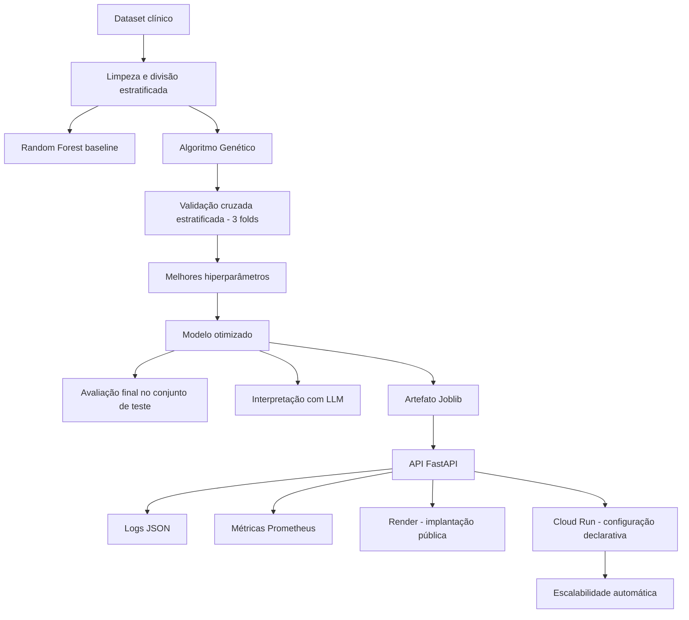

# 🧠 Tech Challenge - Fase 2
## Otimização de Modelos de Diagnóstico e Interpretação com IA Generativa

### FIAP - Pós-Graduação em IA para Desenvolvedores

[](https://colab.research.google.com/github/Val-Faria/tech-challenge-ia-saude/blob/Nirton/02_otimizacao_hiperparametros_ag.ipynb)

## Entregáveis

- [Relatório técnico final em PDF](./Relatorio%20Fase%202.pdf)
- [Notebook executado no Google Colab](./02_otimizacao_hiperparametros_ag.ipynb)
- [Modelo Random Forest otimizado](./models/random_forest_otimizado.joblib)
- [API pública implantada no Render](https://tech-challenge-ia-saude.onrender.com)
- [Documentação interativa da API](https://tech-challenge-ia-saude.onrender.com/docs)
<!-- Quando o vídeo estiver publicado, substitua somente a linha abaixo pelo link do YouTube ou Vimeo. -->
- Vídeo de demonstração: link será adicionado após a gravação e validação final.

---

## 📌 Objetivo

Este projeto tem como objetivo otimizar um modelo de Machine Learning para classificação de pacientes com suspeita de hipotireoidismo utilizando um Algoritmo Genético para seleção automática de hiperparâmetros de um Random Forest.

Além da otimização do modelo, foi integrada uma Large Language Model (LLM) da OpenAI para transformar as previsões do modelo em explicações compreensíveis, auxiliando profissionais de saúde na interpretação dos resultados.

> **Importante:** o sistema possui finalidade acadêmica e experimental. As previsões produzidas não substituem avaliação clínica, diagnóstico médico ou exames laboratoriais.

---

# 📂 Dataset

Foi utilizado o conjunto de dados **Hypothyroid Disease Dataset**, contendo registros clínicos de pacientes utilizados para classificação entre:

- Negative
- Hypothyroid

O conjunto passou pelas etapas de:

- limpeza
- tratamento de valores ausentes
- codificação de variáveis categóricas
- divisão estratificada em treino, validação e teste
- ponderação das classes no Random Forest

---

# 🏗 Arquitetura da Solução

Fluxo geral do projeto:



O conjunto de teste permanece isolado durante a busca de hiperparâmetros. A API
carrega apenas o artefato final e não participa do processo de treinamento.

---

# 🤖 Modelo de Machine Learning

Foi utilizado o algoritmo:

- Random Forest Classifier

O modelo baseline foi comparado com um modelo otimizado através de Algoritmo Genético.

As métricas utilizadas foram:

- Recall (métrica principal)
- Precision
- Accuracy
- F1-Score
- ROC AUC

---

# 🧬 Algoritmo Genético

O Algoritmo Genético foi desenvolvido para otimizar automaticamente os hiperparâmetros do Random Forest.

Os hiperparâmetros avaliados foram:

- n_estimators
- max_depth
- min_samples_split
- min_samples_leaf
- max_features

Características implementadas:

- população inicial aleatória
- seleção por torneio
- crossover de dois pontos
- mutação uniforme inteira com limites por gene
- elitismo real com preservação do melhor indivíduo
- cache de fitness
- histórico completo das gerações
- logging em arquivo e no console

---

# 🧪 Experimentos

Foram realizados três experimentos variando:

- tamanho da população
- número de gerações
- probabilidade de crossover
- taxa de mutação

As configurações usam seeds distintas. Cada indivíduo é avaliado por validação
cruzada estratificada com três folds sobre o conjunto de treino. A seleção é
lexicográfica: maximiza primeiro o Recall médio e utiliza F1-Score e AUC para
resolver empates. O desvio-padrão do Recall é registrado como medida de
estabilidade.

---

# 📊 Resultados

O segundo experimento do Algoritmo Genético foi selecionado, com os seguintes
hiperparâmetros: `n_estimators=149`, `max_depth=20`,
`min_samples_split=8`, `min_samples_leaf=5` e `max_features=log2`.

| Modelo | Accuracy | Precision | Recall | F1-score | AUC-ROC |
|---|---:|---:|---:|---:|---:|
| Random Forest baseline | 0,9914 | 0,9048 | 0,9048 | 0,9048 | 0,9942 |
| Random Forest otimizado | 0,9892 | 0,8333 | 0,9524 | 0,8889 | 0,9947 |

O modelo otimizado aumentou o Recall em 4,76 pontos percentuais, equivalente a
uma variação relativa de 5,26%. Esse ganho reduziu os falsos negativos de dois
para um no conjunto de teste, acompanhado pelo aumento de falsos positivos de
dois para quatro.

O projeto gera automaticamente:

## Figuras

- Evolução do melhor Recall
- Evolução do Recall médio
- Comparação Baseline × Modelo Otimizado
- Matrizes de Confusão
- Importância das Variáveis

## Arquivos CSV

- comparação dos experimentos
- histórico das gerações
- métricas do baseline
- ganhos do modelo otimizado
- importância das variáveis
- interpretação da LLM
- avaliação da resposta da LLM

---

# 💬 IA Generativa

Após a classificação, o projeto envia para uma LLM:

- classe prevista
- probabilidades
- principais variáveis
- métricas do modelo

A IA produz uma interpretação em linguagem natural contendo:

- explicação da previsão
- interpretação das probabilidades
- limitações do modelo
- recomendação de avaliação clínica

A chave da OpenAI é necessária somente para a etapa opcional de geração da
interpretação no notebook. A API de predição publicada no Render utiliza o modelo
Random Forest treinado e não solicita chave da OpenAI ao usuário.

---

# 🛠 Tecnologias Utilizadas

- Python
- Google Colab
- Pandas
- NumPy
- Scikit-Learn
- Matplotlib
- OpenAI API
- Joblib

---

# 📁 Estrutura do Projeto

```text
tech-challenge-ia-saude/
├── api/
│   └── main.py
├── cloudrun/
│   └── service.yaml
├── models/
│   └── random_forest_otimizado.joblib
├── tests/
├── 02_otimizacao_hiperparametros_ag.ipynb
├── Dockerfile
├── Relatorio Fase 2.pdf
├── README.md
├── requirements-api.txt
└── requirements.txt
```

As pastas `dataset/` e `reports/` são criadas automaticamente pelo notebook.

---

# ▶ Como Executar

### 1. Clonar o repositório

```bash
git clone --branch Nirton --single-branch https://github.com/Val-Faria/tech-challenge-ia-saude.git
```

### 2. Acessar a pasta do projeto

```bash
cd tech-challenge-ia-saude
```

### 3. Instalar as dependências

```powershell
python -m venv .venv
.venv\Scripts\Activate.ps1
pip install -r requirements.txt
```

No Linux/macOS, ative o ambiente com `source .venv/bin/activate`.

Para executar somente a API, sem as bibliotecas utilizadas no notebook, instale
`requirements-api.txt` no lugar de `requirements.txt`.

### 4. Configurar a chave da OpenAI (opcional)

Defina a variável de ambiente `OPENAI_API_KEY` ou informe a chave quando o
notebook solicitar. A chave é necessária somente para gerar uma nova interpretação
com a LLM; treinamento, avaliação do Random Forest e uso da API de predição não
dependem dela.

### 5. Abrir o notebook

Abra o arquivo:

```
02_otimizacao_hiperparametros_ag.ipynb
```

preferencialmente utilizando o **Google Colab** ou o **Jupyter Notebook**.

No Colab, use **Ambiente de execução > Executar tudo**. O notebook instala as
dependências essenciais, clona o repositório e baixa o dataset automaticamente.

### 6. Executar os testes

```bash
pytest -q
```

### 7. Executar a API local

O modelo treinado já está versionado em `models/random_forest_otimizado.joblib`.
O notebook pode ser executado novamente para reproduzir o treinamento e substituir
o artefato, caso necessário.

```bash
uvicorn api.main:app --host 0.0.0.0 --port 8080
```

- documentação interativa: `http://localhost:8080/docs`
- saúde: `http://localhost:8080/health`
- métricas: `http://localhost:8080/metrics`

### 8. Utilizar a API pública

A mesma aplicação está implantada no Render e pode ser utilizada sem executar um
servidor local:

- URL base: `https://tech-challenge-ia-saude.onrender.com`
- documentação: `https://tech-challenge-ia-saude.onrender.com/docs`
- saúde: `https://tech-challenge-ia-saude.onrender.com/health`
- métricas: `https://tech-challenge-ia-saude.onrender.com/metrics`

O notebook utiliza a API remota por padrão e também permite selecionar o modo
local. No plano gratuito do Render, o primeiro acesso após um período de
inatividade pode exigir alguns segundos para inicialização.

O arquivo `cloudrun/service.yaml` permanece como referência de uma arquitetura com
escalabilidade automática entre zero e cinco instâncias. A implantação pública
utilizada na demonstração foi realizada no Render; portanto, essa configuração do
Cloud Run não representa uma evidência de autoscaling executado durante o projeto.

## Checklist do vídeo de demonstração

O vídeo deve ter até 15 minutos e ser publicado no YouTube ou Vimeo como público
ou não listado. Para atender ao enunciado, a gravação deve apresentar:

- o notebook sendo executado ou seus resultados já registrados;
- os componentes principais da solução;
- os três experimentos do Algoritmo Genético e o modelo selecionado;
- a comparação entre o Random Forest baseline e o otimizado;
- a geração e a avaliação da interpretação pela LLM;
- uma chamada de predição na API pública.

Quando o link estiver disponível, ele deve ser incluído na seção **Entregáveis**
deste README e na definição `\linkdovideo` do arquivo `main.tex` no Overleaf.


# 👥 Integrantes

- Marcelo Viana de Araujo
- Rodrigo de Moraes Filomeno
- Nirton Afonso de Oliveira Filho
- Valkiria Nonato de Faria
- Benicio Antonio Cardoso

---

# 📚 Instituição

FIAP

Pós-Graduação em Inteligência Artificial para Desenvolvedores

Tech Challenge – Fase 2

2026
